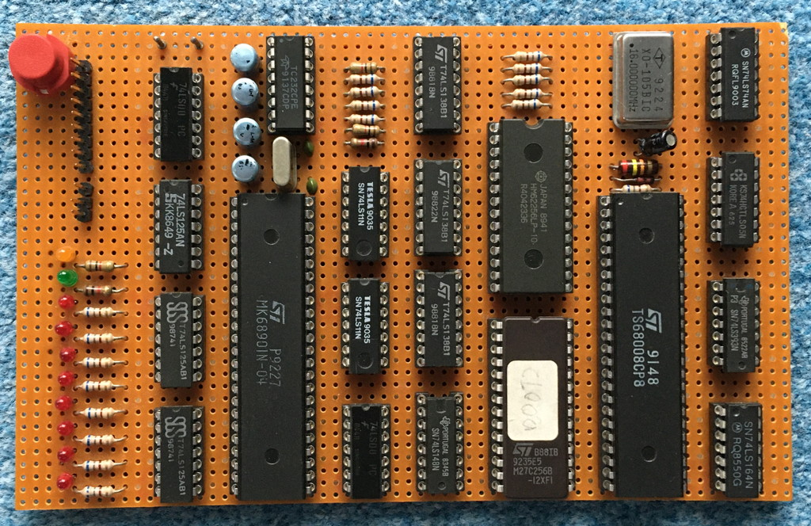
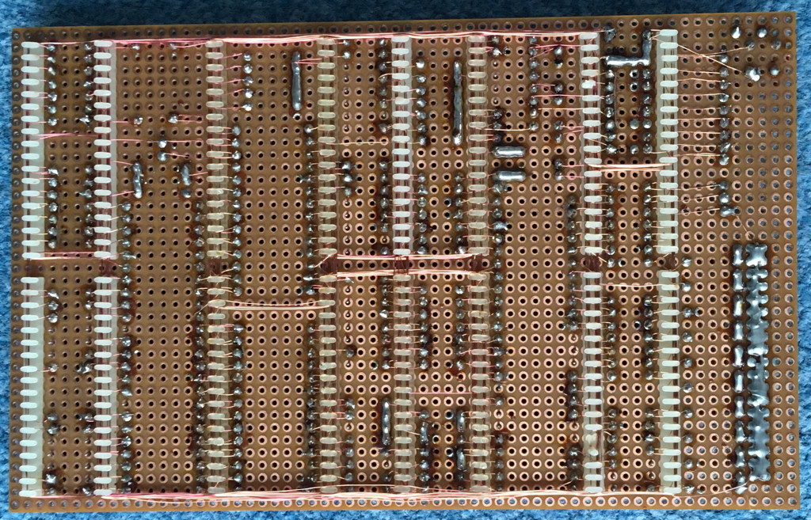
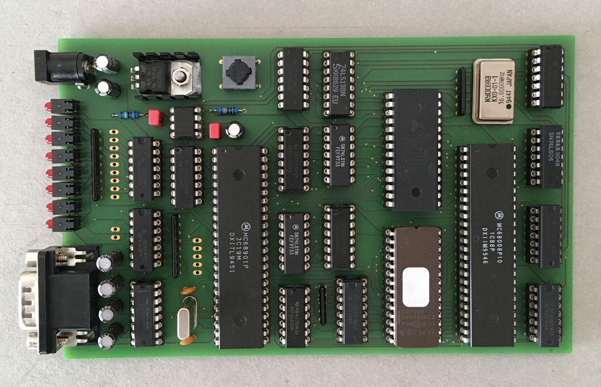
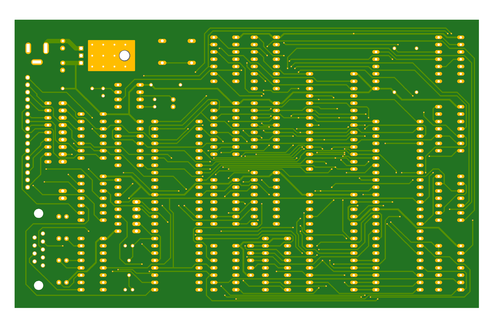
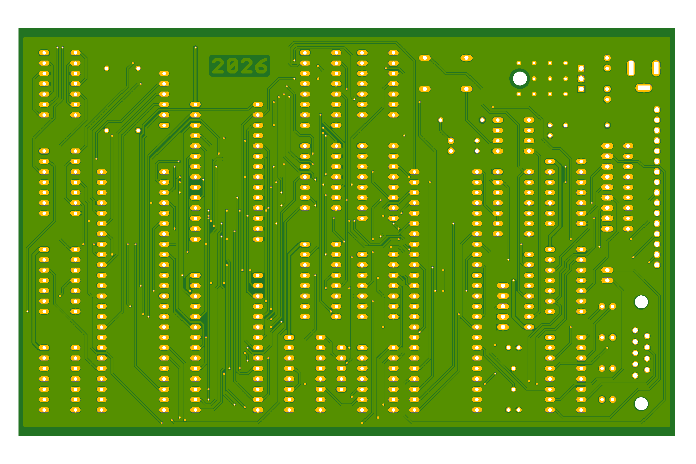

# Hardware

Here you can find a few images of the Thorin hardware. The new board has a few minor enhancements compared to the original. For example the new board uses a NE555 timer to generate the reset signal. Due to lack of space on the original board I only used a resistor/capacitor combination there. The enhancements are minor and do not change any of the features the original had. Their only purpose is to make the hardware more reliable and easier to use/understand. 

## The Original

## The New

