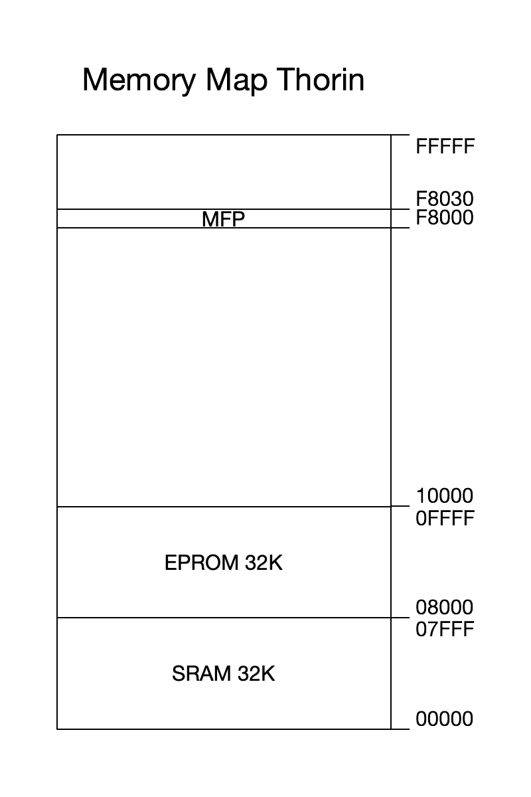

# Software

There are quite a few 68000 assemblers out there. The most popular from what I can tell is the [Easy68K](http://www.easy68k.com/). Advantages are it uses the Motorola assembler syntax and includes an emulator. Disadvantage for me is it's Windows only. Then there is [vasm](http://sun.hasenbraten.de/vasm/) which is a lean and clean assembler used e.g. for Enhanced Basic. And lastly there is the [GNU](https://www.gnu.org/) assembler. The main drawback of GNU is the non Motorola assembler syntax and that the assemblers main purpose is to be part of the GNU compiler chain (it likes to generate relocatable code, leaves unresolved symbols to the linker etc. :-) ). Since I had to relearn the 68000 assembly instructions anyway I didn't mind the quirks of using GNU. The main advantage for me was the included C compiler.

## Ubuntu

To install the 68000 GNU assembler/C compiler:

<pre>
% sudo apt install gcc-m68k-linux-gnu binutils-m68k-linux-gnu srecord
</pre>

And to use the down.pl script this non standard Perl module is also required:

<pre>
% sudo apt install libdevice-serialport-perl
</pre>

## Firmware

The Thorin bootloader is capable of reading S-Record files generated by the assembler/C compiler. The easiest way to use the bootloader is with the [down.pl](../perl) Perl script. Below you can find an [example](../src) download:

<pre>
% srec_info blink.srec 
Format: Motorola S-Record
Header: "blink.srec"
Execution Start Address: 00000400
Data:   0400 - 0449

% down.pl -d /dev/ttyUSB0 -f blink.srec
..................
%
</pre>

The down.pl script can also monitor the output (no input) sent by Thorin after the S-Record file was downloaded and executed. 

<pre>
% down.pl -m -d /dev/ttyUSB0 -f sieve.srec
.........
2 3 5 7 11 13 17 19 23 29 31 37 41
</pre>

And finally it can also send a break to the bootloader causing Thorin to reset (the parallel port LEDs light up).

<pre>
% down.pl -b
</pre>

Please note that the bootloader needs about 30+ bytes of stack memory at the top of the SRAM to function properly. And that the interrupt vectors between 0000 - 0400 need to stay in place for everything to work. 

## Memory

